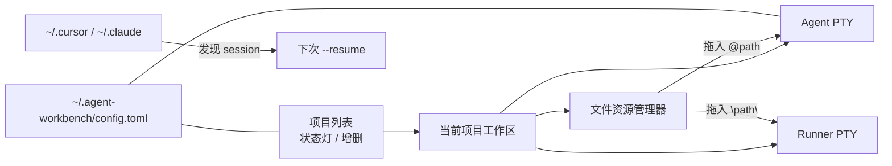
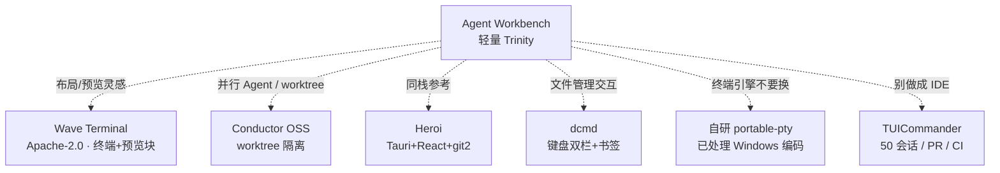

# Agent Workbench：功能总结与开源增强对照

当前项目已经不是「设计稿」，而是一台能跑起来的 **CLI Agent 三位一体桌面工作台**：左侧管项目，右侧固定三栏（资源管理 / Agent 终端 / Runner 终端），PTY 常驻在 Rust 里，切项目、切视图都不杀进程。

它解决的痛点很具体：用 `cursor-agent` / `opencode` / `claude` / `aider` 时，既不想开一整套 IDE，也不想在一堆终端窗口里找「哪个是 Agent、哪个是 npm test」。同类开源软件很多，但几乎没有一个和本项目一模一样——多数要么做成「多 Agent IDE」，要么做成「超级终端」。增强时应该 **借能力、不借产品形态**。

对照设计文档：[`agent-workbench-design.md`](./agent-workbench-design.md)。

---

## 现在实际有什么

对照设计文档和源码，Phase 1 已经落地。

| 模块 | 已实现能力 | 代码位置 |
|---|---|---|
| 多项目工作台 | 项目增删切换、每项目独立双终端、激活项写入配置 | `src/store/workspace.ts`、`src/components/sidebar/ProjectSidebar.tsx` |
| 三位一体布局 | 三栏拖拽分屏、Ctrl+1/2/3 单焦、Ctrl+4 平铺、比例记忆 | `src/components/layout/WorkspacePanels.tsx` |
| 文件管理器 | 书签、面包屑、过滤、排序、列表/图标、双击用系统默认程序打开 | `src/components/explorer/FileExplorer.tsx`、`src-tauri/src/fs/mod.rs` |
| 拖拽注入 | Agent 用可配置前缀（默认 `@`），Runner 用引号绝对路径 | `src/lib/dnd.ts` |
| PTY 保活 | `portable-pty`、会话复用、generation 防串流、Windows UTF-8/GBK、剥离 conda/venv 污染 PATH | `src-tauri/src/pty/mod.rs` |
| Agent 预设 | cursor-agent / opencode / claude / aider，命令与拖拽前缀可配 | `src-tauri/src/config/mod.rs` |
| 会话续跑 | 轮询 `~/.cursor/chats`、`agent-transcripts`、`~/.claude/projects`，启动时 `--resume` / `--session` | `src-tauri/src/session.rs`、`src/hooks/useAgentSessionCapture.ts` |
| 状态与通知 | 输出中 / 等待输入 / 退出 / 错误；长时间任务结束后系统 Toast | `src/hooks/usePtyStatusListener.ts`、`src/lib/notify.ts` |

产品哲学已经写在 `AGENTS.md` 里：**极简、低内存（目标 &lt;100MB）、PTY 绝对不能被 UI 切视图干掉、配置单文件 TOML**。后面加开源能力时，这四条是硬约束。

---

## 同类开源：按功能对标，不要整仓替换

没有一个仓库等于「Agent Workbench」。更准确的做法是：每个模块找一个 **成熟参考**，再决定是抄交互、抄 crate，还是只学思路。

### 1. 整体产品：最近的是「Agent 编排壳」，不是 IDE

| 项目 | 和本项目像在哪 | 不该照搬的地方 |
|---|---|---|
| [Heroi](https://github.com/danielss-dev/heroi) | **技术栈几乎同款**：Tauri v2 + React 19 + Zustand + Tailwind + xterm；项目/仓库列表 + 内嵌 Agent CLI | 未声明许可证，不能直接搬代码；没有「资源管理 + Agent + Runner」三栏，也没有 drag-to-inject |
| [Conductor OSS](https://github.com/charannyk06/conductor-oss) | 本地优先、真正 PTY、启动已安装的 CLI（含 cursor-agent / opencode） | 核心增量是 **git worktree 隔离并行 Agent**，产品更重 |
| [TUICommander](https://github.com/sstraus/tuicommander) | 多仓库、PTY 保活、Agent 自动识别 | 已经是 AI-native IDE（diff、PR、CI、插件、语音）。抄完会直接违背「轻量克制」 |
| [Pixie](https://github.com/white1or1black/pixie) | 多 workspace、侧栏 Files/Git/Terminal | 把 CLI 的 JSON 流渲染成 GUI，产品从「终端工作台」变成「Agent 外壳」 |
| [Wave Terminal](https://github.com/wavetermdev/waveterm) | 块布局、单块全屏再回到平铺、文件预览、本地优先 | Go 后端、内置编辑器/浏览器/AI 聊天。布局理念可学，架构不能并入 |

**结论：** 本项目的差异化已经成立——**Explorer 是一级面板，Agent 和 Runner 永久并列，拖文件就是在给 CLI 喂路径**。同类产品多半把文件树当附属，或把第二个终端省略掉。不要把自己做成 TUICommander 的缩小版。

### 2. 终端：引擎留着，增强用 addon 和交互

自研 PTY 已经处理了 Windows 编码、generation、conda PATH，这是真实踩坑代码，**不要换成** 还在 Developing 的 [`tauri-plugin-pty`](https://github.com/Tnze/tauri-plugin-pty)。

更值得参考：

- **xterm.js 官方 addon**（MIT，可直接装）：`@xterm/addon-search`（Ctrl+F）、`@xterm/addon-web-links`、`@xterm/addon-serialize`（滚动缓冲持久化）。现在只有 Fit + WebGL。
- [WezTerm](https://github.com/wez/wezterm)（MIT）：分屏、会话恢复、从外部 `cli` 往 pane 写字。交互可学，不必嵌整颗 GPU 终端。
- [Tabby](https://github.com/Eugeny/tabby)（MIT）：SSH/SFTP 插件化。若永远做本地 Agent 工作台，SSH 是噪音。
- Wave 的 **command blocks**：把每次命令输出切成可复制块。对 Runner 有价值，对 TUI Agent（全屏 TUIs）几乎无用，优先级低。

### 3. 文件管理器：最大短板，也最容易借

现在的 Explorer 是「只读浏览器」：列目录、过滤、拖路径。Agent 改文件后列表不会自动刷新；没有预览、多选、复制/移动、隐藏文件、虚拟滚动。

| 参考 | 可借的点 | 建议用法 |
|---|---|---|
| [dcmd](https://github.com/tendant/dcmd) | 同栈（Tauri 2 + React + Rust）；命令面板、书签快捷键、F3 预览、**Open terminal here** | 交互蓝本，最贴本项目 |
| [KrakenEgg](https://github.com/andrewhofmann/KrakenEgg) | 大目录虚拟滚动、前进/后退、记住光标 | 抄 `react-window` 模式即可 |
| [FileOctopus](https://github.com/ilyafedotov-ops/FileOctopus) | Rust 侧作业队列、`local://` 信任边界 | 学安全边界；本项目已有 `allowed_roots` |
| [COSMIC Files](https://github.com/pop-os/cosmic-files) | 双栏、缩略图 | Linux DE 组件，不要嵌 |
| Wave 预览系统 | md / 图 / csv / 代码按类型分流 | 第四块「预览」或 Explorer 底部分栏 |

目录刷新应直接用官方 **`@tauri-apps/plugin-fs` 的 `watch`（notify）**，不要自己轮询。Agent 改代码时 Explorer 立刻更新，这是工作台体感差距最大的一项。

### 4. 多 Agent / Git：这是下一阶段最有杠杆的功能

现在是「一个项目一对 Trinity」。两个 Agent 改同一个 working tree 会互相踩。业界共识是 **worktree 隔离**：

- Conductor OSS / Heroi / TUICommander 都走这条路
- Rust 侧成熟库是 [`git2`](https://crates.io/crates/git2)（MIT/Apache-2.0），Heroi 也用它

建议形态：项目下可以「派生一次 Agent 会话」→ 自动 `git worktree add` → 新的 Agent+Runner 绑到 worktree 路径。这比做内置 diff 编辑器更符合本项目的定位。

Heroi **没有许可证**，只能对照交互，不要复制源码。优先读 Conductor OSS 的 worktree 生命周期。

### 5. 会话续跑：这块已经领先多数 OSS

`session.rs` 去扫 Cursor / Claude 本地 transcript，启动时带 `--resume`。TUICommander 做的是「识别 Agent 在干什么」，Wave 做的是自有 AI widget。本项目的路径更贴「外壳包已有 CLI」。

可增强的是 **预设表**：补 Codex / Gemini CLI 的 resume 参数，并做成配置而不是写死在 `resumeArgsForSession`。不必上 MCP 代理、语音、CI auto-heal。

---

## 建议怎么引入：增强，而不是换壳

原则：**加 crate / addon / 交互模式；不 fork 整仓；不引入编辑器/浏览器。**

### 第一档（收益高、不破坏 Trinity）

1. **目录监听刷新**  
   `tauri-plugin-fs` + `watch`，当前文件夹变更后重拉 `fs_list`。

2. **终端搜索与链接**  
   装 `@xterm/addon-search`、`@xterm/addon-web-links`。滚动缓冲可用 serialize，避免切视图后只能靠 PTY 进程活着、前端 buffer 丢了。

3. **Explorer 键盘与多选拖拽**  
   对照 dcmd：Backspace 返回、输入即过滤（已有搜索框）、多文件一次 inject。这是 drag-to-inject 的自然延伸。

4. **轻量预览**  
   选中 md/图/文本时在 Explorer 下方或可折叠第四栏预览。学 Wave 的「按类型分流」，不要上 Monaco。

### 第二档（真正拉开和「普通终端」的差距）

5. **Git worktree 会话**  
   `git2`：列出/创建/删除 worktree；侧栏从「项目」变成「项目 → 会话」。每个会话仍是一套 Trinity。这是和 Conductor / Heroi 对齐、又保住三栏模型的关键一步。

6. **Git 状态条，而不是 Git IDE**  
   当前分支、是否 dirty、worktree 路径。完整 stage/commit/PR 留给用户自己的 Git 客户端或 Cursor。

### 第三档（明确不做，除非产品转向）

- 内置代码编辑器、内嵌浏览器、SSH、50 路 PTY 网格、审批队列、语音 Whisper
- 用 `tauri-plugin-pty` 替换现有 PTY
- 把 Agent 终端改成聊天泡泡（Pixie 路线）——那会丢掉「CLI 就是真相」这条线

---

## 和开源的定位差在哪

别人在做「多 Agent 并行操作系统」或「带预览的超级终端」。本项目已经做完的是更窄的一件事：

> **给每个本地项目一个永不丢失的 Agent CLI + 一个干净 Runner + 一个能把路径喂进 CLI 的文件管理器。**

开源该用来补 **刷新、预览、键盘、worktree**，而不是把工作台做成第二个 Cursor。

建议落地顺序：**目录 watch → xterm search → 多选拖拽 → 文件预览 → git worktree 会话**。
